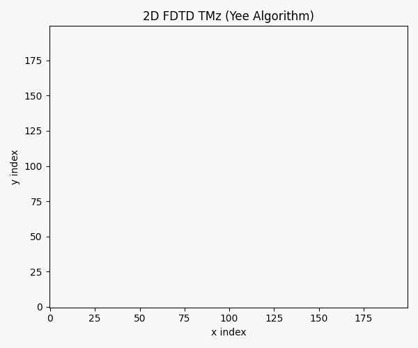

# Computational-Electrodynamics-

This repository is a graduate-level study of electrodynamics based on *Classical Electrodynamics by J. D. Jackson*, combining rigorous theoretical derivations with computational implementations and visualizations.

---

## Website

- Live site: [dajuarez4.github.io/Computational-Electrodynamics](https://dajuarez4.github.io/Computational-Electrodynamics/)

---

## Approach

Each topic follows a structured workflow:

> **Theory → Code → Visualization**

- Derivations written in LaTeX within Jupyter notebooks  
- Numerical implementations using Python  
- Visualizations to develop physical intuition  

---

## Repository Structure

- `notebooks/` — Theory, derivations, and computational explorations  
- `problems/` — Topic-based problem sets in LaTeX and PDF  
- `Formula Sheet/` — One-page quad-chart formula sheets in LaTeX and PDF  
- `notes-diego/` — Personal study notes, chapter PDFs, and support materials  

---

## Topics Covered

- Dirac delta functions  
- Poisson and Laplace equations  
- Green’s functions  
- Method of images  
- Multipole expansion  
- Dielectrics  
- Electromagnetic radiation  

---

## Tools & Technologies

- Python (NumPy, SciPy, Matplotlib)
- Jupyter Notebook
- LaTeX (for mathematical derivations)

---
## Topic Materials

- `Dirac Delta`: [Notebook](./notebooks/Dirac%20delta%20functions.ipynb), [Problem Set](./problems/Dirac_Delta_problems.pdf), [Formula Sheet](./Formula%20Sheet/dirac_delta_formula_sheet.pdf)
- `Poisson's Equation`: [Notebook](./notebooks/Poisson%27s%20equation.ipynb), [Problem Set](./problems/Poisson_equation.pdf), [Formula Sheet](./Formula%20Sheet/poisson_formula_sheet.pdf)
- `Laplace's Equation`: [Notebook](./notebooks/Laplace%27s%20equation.ipynb), [Problem Set](./problems/Laplace_equation.pdf), [Formula Sheet](./Formula%20Sheet/laplace_formula_sheet.pdf)
- `Green's Functions`: [Notebook](./notebooks/Green%27s%20functions%20in%20electrostatics.ipynb), [Problem Set](./problems/Green_functions.pdf), [Formula Sheet](./Formula%20Sheet/greens_functions_formula_sheet.pdf)
- `Method of Images`: [Notebook](./notebooks/Method%20of%20images%20in%20electrostatics.ipynb), [Problem Set](./problems/method_of_images.pdf), [Formula Sheet](./Formula%20Sheet/method_of_images_formula_sheet.pdf), [Chapter 2 Notes](./notes-diego/chapter-2/chapter_2_notes.pdf)
- `Multipole Expansion`: [Notebook](./notebooks/Multipole%20expansion%20in%20electrostatics.ipynb), [Problem Set](./problems/multipole_expansion.pdf), [Formula Sheet](./Formula%20Sheet/multipole_formula_sheet.pdf)
- `Dielectrics`: [Notebook](./notebooks/Dielectrics%20in%20electrostatics.ipynb), [Problem Set](./problems/dielectrics_problems.pdf), [Formula Sheet](./Formula%20Sheet/dielectrics_formula_sheet.pdf)
- `Electromagnetic Radiation`: [Notebook](./notebooks/Electromagnetic%20Radiation.ipynb), [Problem Set](./problems/electro_magnetic_radiation.pdf), [Formula Sheet](./Formula%20Sheet/electromagnetic_radiation_formula_sheet.pdf)

---

## Notes

- `Vector Formulas`: [Reference PDF](./notes-diego/vector-formulas/Vector_formulas.pdf)
- `Calculus Theorems`: [PDF](./notes-diego/calculus-theorems/calculus_theorems.pdf), [Notebook](./notes-diego/calculus-theorems/theorems_from_calculus.ipynb)
- `Chapter 1`: [Jackson-PDF](./notes-diego/chapter-1/chapter-1.pdf), [Notes PDF](./notes-diego/chapter-1/chapter_1_notes.pdf)
- `Chapter 2`: [Jackson-PDF](./notes-diego/chapter-2/chapter-2.pdf), [Notes PDF](./notes-diego/chapter-2/chapter_2_notes.pdf)
- `Chapter 3`: [Jackson-PDF](./notes-diego/chapter-3/chapter-3.pdf), [Notes PDF](./notes-diego/chapter-3/chapter_3_notes.pdf)
- `Chapter 4`: [Jackson-PDF](./notes-diego/chapter-4/chapter-4.pdf), [Notes PDF](./notes-diego/chapter-4/chapter_4_notes.pdf)
- `Chapter 5`: [Jackson-PDF](./notes-diego/chapter-5/chapter-5.pdf), [Notes PDF](./notes-diego/chapter-5/chapter-5_notes.pdf)

---

## Visualizations

The repository also includes interactive and static visualizations that build intuition for how the Dirac delta function behaves as a sampling device rather than as an ordinary spike.

### Dirac Delta v2: Charge Hunt

The charge-density plot shows a one-dimensional localized source profile with positive and negative contributions. The heatmap shows the detector response `|∫ ρ(x) δ_ε(x-a) dx|`, which becomes strongest when the sampling point is centered on a source and the kernel is sufficiently narrow.

### Method of Images
The animation below shows the grounded-sphere method of images: as the external source moves, the image charge changes position and magnitude so that the sphere remains at zero potential.

### Yee FDTD Method
A 2D TMz Yee-grid simulation of a Gaussian pulse scattering from a dielectric disk. [Open the notebook](./notebooks/Yee_FTD_method.ipynb).

---

## Goal

The goal of this project is to bridge **analytical electrodynamics** and **computational physics**, enabling a deeper understanding of physical phenomena through both theory and simulation.

---

## Future Work

- Advanced numerical solvers for boundary value problems  
- Interactive visualizations  
- Time-dependent electromagnetic simulations  
- Extensions to relativistic electrodynamics  

---

## Contributions

This is a personal academic project, but suggestions, ideas, and collaborations are always welcome.

---

## Reference

Jackson, J. D. *Classical Electrodynamics*, 3rd Edition.

## Problem solved by Dr Baird
* [Good notes, problem-solving and lectures by Dr Baird](https://www.wtamu.edu/~cbaird/courses.html)
