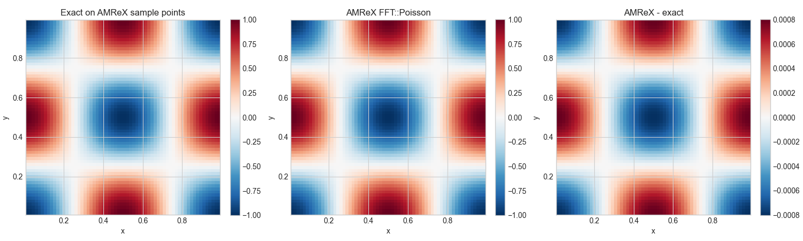

# AMReX FFT Poisson Benchmark

This mini-app reproduces the manufactured 3D periodic Poisson benchmark already used by
`codes/cpp/fft_poisson/fft_poisson_3d.cpp`, but through AMReX's `FFT::Poisson` solver.

It is designed to support the notebook:

- [AMReX Comparison - 3D FFT Poisson Benchmark.ipynb](../../../notebooks/AMReX%20Comparison%20-%203D%20FFT%20Poisson%20Benchmark.ipynb)
- [AMReX FFT Poisson Benchmark Notes](../../../notes/amrex_fft_poisson_benchmark_notes.tex)

## How It Is Implemented Here

This mini-app is a small AMReX wrapper around the same manufactured periodic Poisson benchmark already used by
`codes/cpp/fft_poisson/fft_poisson_3d.cpp`.

The implementation in this repository is:

1. `inputs` defines the grid size, domain lengths, `eps0`, plotfile path, and compare-output directory.
2. [`main.cpp`](./main.cpp) builds a 3D periodic `Geometry`, `BoxArray`, and `DistributionMapping`.
3. The code allocates `MultiFab` fields for `rho`, `rhs`, `phi`, `phi_exact`, and `error`.
4. It fills a manufactured exact solution
   `phi_exact(x,y,z) = cos(2 pi x / Lx) cos(2 pi y / Ly) cos(2 pi z / Lz)`
   on a cell-centered grid, then derives `rho` from Poisson's equation.
5. It forms the right-hand side as `rhs = -rho / eps0` and subtracts the discrete mean to enforce the periodic compatibility condition.
6. It solves the periodic problem with `amrex::FFT::Poisson<amrex::MultiFab>`.
7. It writes an AMReX plotfile for visualization and also exports `.npy` arrays for notebook comparison.
8. [`scripts/package_amrex_compare_npz.py`](../../../scripts/package_amrex_compare_npz.py) packages those arrays into `amrex_compare/fft_poisson_benchmark.npz`, which the notebook loads automatically.

## What The Comparison Means

The notebook compares three different things:

- the continuous manufactured exact solution,
- the repository's standalone spectral FFT benchmark,
- the AMReX `FFT::Poisson` solution.

The first two match to roundoff because they are effectively solving the same continuous periodic spectral problem.

The AMReX row is different: `FFT::Poisson` solves the discrete Poisson operator on the AMReX grid. In the AMReX implementation, the Fourier-space denominator uses the discrete Laplacian symbol built from `cos(...) - 1` terms. That means the AMReX solution is expected to differ from the continuous manufactured solution by the normal second-order truncation error of the discrete operator.

For this `64^3` benchmark, that is why the notebook reports an AMReX relative `phi` error of about `8e-4` instead of machine precision. That is an expected discretization effect, not a solver failure.

## What It Writes

When run from the repository root with the default `inputs`, the app writes:

- `plt_amrex_fft_poisson_benchmark/`
  Single-level AMReX plotfile with `phi`, `rho`, `phi_exact`, and `error`
- `amrex_compare/fft_poisson_benchmark_amrex/`
  Directory with NumPy `.npy` arrays and a `label.txt` file

Then package those arrays into the `.npz` used by the notebook with:

```bash
python3 scripts/package_amrex_compare_npz.py \
  --input-dir amrex_compare/fft_poisson_benchmark_amrex \
  --output amrex_compare/fft_poisson_benchmark.npz
```

## Build

This project expects an installed AMReX build with 3D and FFT support.

Important:

- `/path/to/amrex/install` below is a placeholder, not a literal path.
- Run the commands from the repository root, not from `Jackson-problems/` or another subdirectory.
- You can point CMake either at the AMReX install prefix with `AMReX_ROOT` or directly at the package directory with `AMReX_DIR`.
- This benchmark requires an AMReX installation that was built with the `FFT` component enabled.

```bash
cmake -S codes/amrex/fft_poisson_benchmark \
  -B codes/amrex/fft_poisson_benchmark/build \
  -DAMReX_ROOT=/absolute/path/to/amrex-install

cmake --build codes/amrex/fft_poisson_benchmark/build -j
```

Equivalent direct-package form:

```bash
cmake -S codes/amrex/fft_poisson_benchmark \
  -B codes/amrex/fft_poisson_benchmark/build \
  -DAMReX_DIR=/absolute/path/to/amrex-install/lib/cmake/AMReX
```

AMReX CMake import docs:

- https://amrex-codes.github.io/amrex/docs_html/BuildingAMReX.html

## Concrete Local Install Example

If AMReX is not installed yet, one clean local layout is:

- AMReX source: `/Users/dajuarez4/src/amrex`
- AMReX install prefix: `/Users/dajuarez4/.local/amrex`

Using the official AMReX CMake build flow, a CPU-only install for this benchmark looks like:

```bash
git clone https://github.com/AMReX-Codes/amrex.git /Users/dajuarez4/src/amrex

cmake -S /Users/dajuarez4/src/amrex \
  -B /Users/dajuarez4/src/amrex/build \
  -DCMAKE_BUILD_TYPE=Release \
  -DCMAKE_INSTALL_PREFIX=/Users/dajuarez4/.local/amrex \
  -DAMReX_MPI=NO \
  -DAMReX_OMP=NO \
  -DAMReX_FORTRAN=NO \
  -DAMReX_FFT=YES

cmake --build /Users/dajuarez4/src/amrex/build -j
cmake --install /Users/dajuarez4/src/amrex/build
```

Then build this repo's benchmark with:

```bash
cmake -S codes/amrex/fft_poisson_benchmark \
  -B codes/amrex/fft_poisson_benchmark/build \
  -DAMReX_ROOT=/Users/dajuarez4/.local/amrex
```

For CPU builds, AMReX's FFT support uses FFTW. If the AMReX configure step fails while looking for FFTW, install FFTW first and rerun the AMReX build.

## Run

Run it from the repository root so the default output paths land in this repo:

```bash
./codes/amrex/fft_poisson_benchmark/build/amrex_fft_poisson_benchmark \
  codes/amrex/fft_poisson_benchmark/inputs
```

Then package the compare arrays:

```bash
python3 scripts/package_amrex_compare_npz.py \
  --input-dir amrex_compare/fft_poisson_benchmark_amrex \
  --output amrex_compare/fft_poisson_benchmark.npz
```

## Troubleshooting

If CMake says it cannot find `AMReXConfig.cmake`, then AMReX is either not installed yet or the path you passed is not the real install location. The executable will not be built until that is fixed.

If `./codes/amrex/fft_poisson_benchmark/build/amrex_fft_poisson_benchmark` does not exist, the configure or build step failed earlier. Fix the CMake error first, then rebuild.

If the packaging script says `Missing required array: .../phi.npy`, the AMReX executable never ran successfully, so there is nothing to package yet.

## Notes

- This first pass is intended as a clean correctness comparison, not an AMR demonstration yet.
- The app uses a cell-centered periodic grid and writes the sample coordinates `x.npy`, `y.npy`, and `z.npy`.
- The notebook uses those coordinates to evaluate the exact solution at the same sample locations before computing errors.
- The direct `.npy` export path is currently aimed at a serial run with one box and host-accessible data. If you later move this mini-app to multi-rank or device-only GPU memory, the exporter is the first place to generalize.

## Results

The notebook produces two result figures for this benchmark:

- the continuous manufactured solution compared against the notebook-side Python FFT solve and the repository's standalone C++ FFT solve,
- the AMReX `FFT::Poisson` solution compared against the exact field evaluated on the AMReX sample points.





## Primary AMReX references:

Weiqun Zhang, Ann Almgren, Vince Beckner, John Bell, Johannes Blaschke, Cy Chan, Marcus Day, Brian Friesen, Kevin Gott, Daniel Graves, Max Katz, Andrew Myers, Tan Nguyen, Andrew Nonaka, Michele Rosso, Samuel Williams, and Michael Zingale, "AMReX: a framework for block-structured adaptive mesh refinement," *Journal of Open Source Software* 4(37), 1370, 2019. DOI: `10.21105/joss.01370`

- Official AMReX repository: https://github.com/AMReX-Codes/amrex
- Official AMReX documentation: https://amrex-codes.github.io/amrex/docs_html/Introduction.html
- JOSS article DOI: https://doi.org/10.21105/joss.01370
