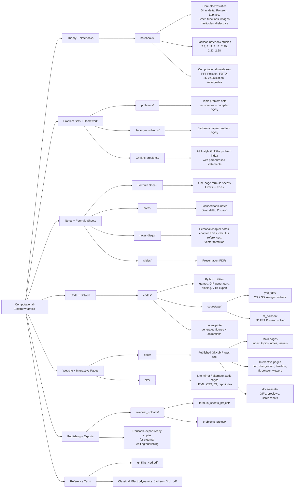

# Repo Mindmap

This file gives a high-level map of how the repository is organized.

## Visual Map

## Text Outline

- `notebooks/`
  Theory notebooks, derivations, computational experiments, Jackson-focused worked studies, and visualization notebooks.
- `problems/`
  Topic-centered problem sets in LaTeX and PDF.
- `Jackson-problems/`
  Chapter-based Jackson problem material.
- `Griffiths-problems/`
  Griffiths exercise index and solution-related material.
- `Formula Sheet/`
  Compact formula sheets in both `.tex` and `.pdf`.
- `notes/` and `notes-diego/`
  Structured notes, chapter summaries, calculus support material, and personal study references.
- `slides/`
  Presentation PDFs and lecture-style material.
- `codes/`
  Python scripts for animations, games, numerical workflows, plotting, and exports.
- `codes/cpp/`
  Standalone C++ solvers, especially `yee_fdtd/` and `fft_poisson/`.
- `docs/`
  The main static website deployment target, including interactive pages and media assets.
- `site/`
  A parallel static-site layer with overlapping pages and supporting assets.
- `overleaf_uploads/`
  Exportable copies of formula-sheet and problem-set projects for external editing workflows.
- Root PDFs
  Primary textbook references and a few top-level artifacts used to support the study workflow.

## How To Read This Repo

- `Theory -> problems -> notes -> code -> visualization` is the main academic workflow.
- `docs/` is the public-facing layer.
- `codes/` and `codes/cpp/` are the implementation layer.
- `notebooks/`, `problems/`, `Formula Sheet/`, and `notes-diego/` are the learning-content core.
